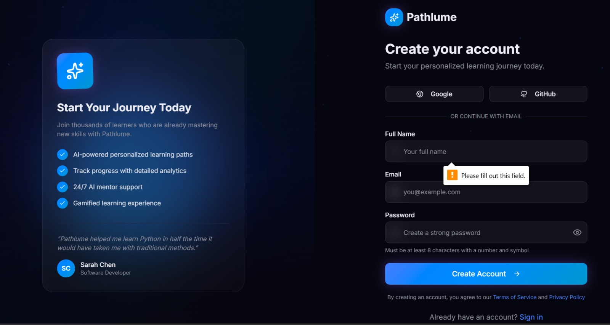
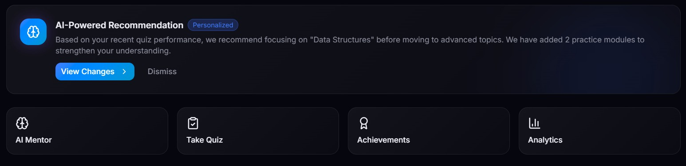
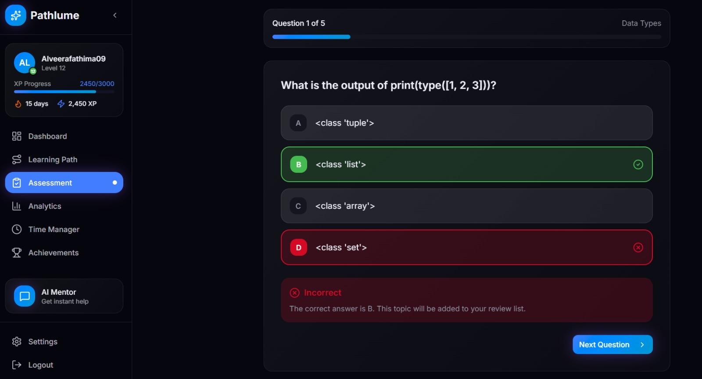
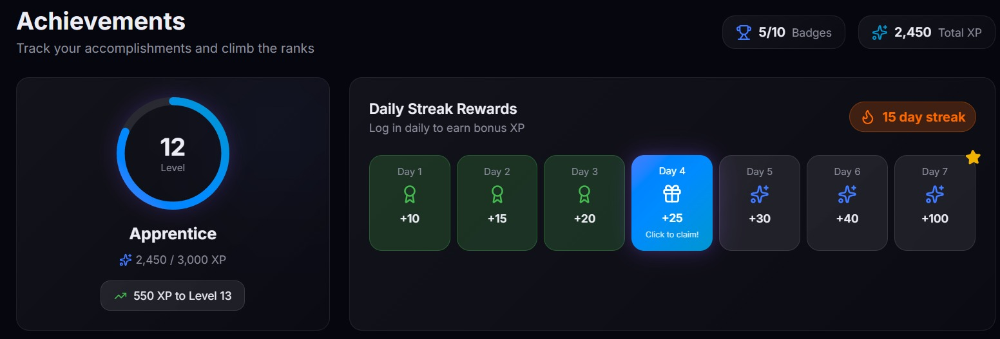
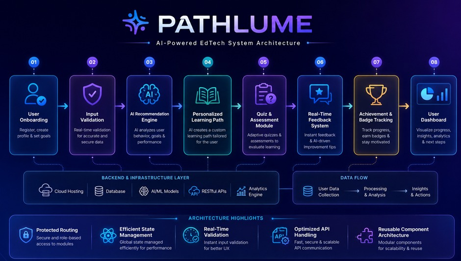

# 🌌 Pathlume — AI-Powered EdTech Platform

[](https://nextjs.org/)
[](https://reactjs.org/)
[](https://tailwindcss.com/)
[](https://www.typescriptlang.org/)

Pathlume is a cutting-edge, adaptive e-learning ecosystem designed to dismantle the rigid structures of traditional education. By analyzing real-time user performance and behavior, Pathlume dynamically crafts **personalized learning paths**, deploys **adaptive assessments**, and integrates **gamified feedback loops** to ensure optimized skill mastery.

---

# 🌍 UN SDG GLOBAL IMPACT ALIGNMENT

## 🎯 SDG 4 – Quality Education


PATHLUME AI promotes accessible, organized, and personalized education by helping learners discover structured pathways and high-quality learning resources.

## 🚀 SDG 9 – Industry, Innovation & Infrastructure


The platform integrates AI-powered innovation into education technology to create smarter and more scalable learning systems.

<p align="center">
</p>


## 🚀 Key Features & Interface

### 1. Frictionless Onboarding & Secure Authentication

A streamlined, high-converting entry point supporting standard credential creation alongside single-sign-on (SSO) OAuth integrations via **Google** and **GitHub**. Real-time form state validation prevents faulty data entry at the baseline layer.

### 2. AI-Powered Dynamic Recommendation Engine

Pathlume constantly runs analytics behind the scenes. Based on your immediate quiz performance and behavioral telemetry, the recommendation engine flags conceptual gaps (e.g., catching structural weaknesses in *Data Structures*) and dynamically injects target practice modules to reinforce understanding before letting learners advance.

### 3. Adaptive Assessment & Real-Time Feedback

Assessment sheets break away from static question pools. Quizzes adapt in difficulty based on previous answers. The dashboard offers immediate, contextual error handling, letting users know instantly why an answer is incorrect and tracking historical telemetry to build custom review lists.

### 4. Gamified Progress Mechanics & Streak Rewards

To maximize retention and platform stickiness, Pathlume features a complete RPG-style leveling system (`Apprentice` to advanced tiers), granular XP progress metrics, badging architecture, and compound daily streak milestones backed by claimable XP rewards.

---

## 🛠️ System Architecture

Pathlume is built on a modern, decoupled tech stack designed to scale seamlessly under heavy concurrent user loads.



### Core Architecture Pipeline
1. **User Onboarding:** Secure profile initialization & objective mapping.
2. **Input Validation:** High-speed processing layer for real-time form sanitization.
3. **AI Recommendation Engine:** Deep behavioral and performance intelligence computation.
4. **Personalized Learning Path:** Structural execution of a tailored, step-by-step syllabus.
5. **Quiz & Assessment Module:** Adaptive evaluation matrix with conditional question routing.
6. **Real-Time Feedback System:** Prompt analytical insights and actionable improvement vectors.
7. **Achievement Tracking:** High-speed update ledger managing gamified badges & state progression.
8. **User Dashboard:** Aggregated data visualizer highlighting analytics, time-tracking, and next steps.

### Backend & Infrastructure Layer
* **Cloud Hosting:** Highly available, low-latency globally distributed web deployments.
* **Database:** Structured relational schema mapping complex user profiles, historical metrics, and relational learning node graphs.
* **AI/ML Engine:** Intelligent inference modeling computing real-time course recommendations.
* **RESTful API Handling:** Fast, secure, asynchronous API communication channels.

---

## 💎 Engineering Highlights

* 🔒 **Protected Routing:** Secure, middleware-driven role-based access tokens governing exclusive modules, dashboard views, and administrative controls.
* ⚡ **Efficient State Management:** Global app state managed with peak performance in mind, ensuring snappy UI updates, persistence across sessions, and minimal re-renders.
* 📦 **Reusable Component Architecture:** Built using highly modular, atomic design principles allowing for rapid code scalability, code clarity, and structural reuse.
* 🎨 **UI/UX Excellence:** Custom, immersive dark-cyberpunk glassmorphic aesthetics engineered with pixel-perfect responsive Tailwind CSS layouts.

---

## 🛠️ Installation & Local Setup

To clone and run this application locally on your machine, follow these steps:

### Prerequisites
Make sure you have **Node.js** (v18 or higher) and **npm** installed.


 ## 1️⃣ Clone the Repository

```bash
git clone https://github.com/alveerafathima09-62/PATHLUME---AI-.git
```

 ## 2️⃣ Navigate to Project Directory

```bash
cd PATHLUME---AI-
```

 ## 3️⃣ Install Dependencies

```bash
npm install
```

## 4️⃣ Run Development Server

```bash
npm run dev
```

## 5️⃣ Open in Browser

```text
http://localhost:3000
```

# 🧪 TESTING & RESILIENCE

##PATHLUME AI 
was tested for multiple edge cases and unexpected user interactions to ensure platform stability and reliability.

💡Implemented Testing Features
💡Input validation for empty searches
💡Secure authentication handling
💡Error message prompts for invalid input
💡Responsive UI testing across devices
💡AI fallback recommendations during API failures
💡Optimized navigation and loading behavior
💡Graceful handling of unexpected failures

These implementations improved overall user experience and application reliability.

# 🔄 REFACTORING & OPTIMIZATION

Continuous refactoring was performed throughout development to improve scalability, readability, and maintainability.

💡Improvements Included
💡Modular React component structure
💡Cleaner folder organization
💡Reusable UI components
💡Reduced duplicate code
💡Improved responsive layouts
💡Faster rendering performance
💡Enhanced frontend consistency

These optimizations helped transform PATHLUME AI into a cleaner and more scalable platform.

# 📈 FUTURE ENHANCEMENTS

🚀 AI Mentor Chatbot
🚀 Gamified Learning Experience
🚀 Progress Analytics Dashboard
🚀 AI-Based Skill Assessments
🚀 Certification & Achievement System
🚀 Advanced Personalized Recommendations

# 👨‍💻 TEAM INFORMATION
| Team Member | Role |
|---|---|
| Alveera Fathima | Frontend Development & Documentation |
| G. Sri Vidya | UI/UX & Development |


# 🌌GITHUB REPOSITORY 


# 💡 Vision Statement
✨ “We’re not building another edtech platform.
We’re building the GPS for learning.” ✨

# 🏆 Conclusion

PATHLUME AI combines artificial intelligence, structured education, and modern UI/UX principles to create a smarter and more personalized learning experience.

The platform aims to reduce confusion, improve consistency, and guide learners toward mastery through AI-powered educational pathways.

By integrating scalable frontend architecture with intelligent recommendation systems, PATHLUME AI represents the future of modern education technology.

<div align="center">

## ⭐ Made with passion by Team Cipher ⭐

</div>
