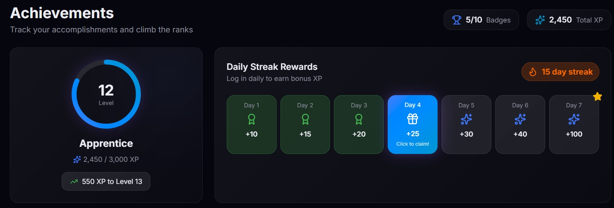

# Pathlume
### Illuminate Your Way to Mastery

Pathlume AI is an adaptive, AI-powered e-learning platform designed to eliminate information overload and structure the modern learning experience. By analyzing user interaction, the platform dynamically generates personalized learning roadmaps, smart topic recommendations, and interactive assessments.

---

## 🌍 UN SDG Global Impact Alignment
* **SDG 4 – Quality Education:** Promotes accessible, organized, and personalized learning by helping users navigate structured educational pathways.
* **SDG 9 – Industry, Innovation & Infrastructure:** Integrates AI innovation into educational technology to build scalable learning systems.

---


## 🚀 Key Features & Interface


- ✅ AI-Powered Personalized Learning Paths
- ✅ Smart Topic Recommendations
- ✅ Structured Learning Roadmaps
- ✅ Modern Futuristic UI/UX
- ✅ Responsive Design Across Devices
- ✅ Authentication System
- ✅ Beginner-Friendly Experience
- ✅ Scalable Frontend Architecture
- ✅ Progress-Oriented Learning Flow


# 🖥️ FINAL GALLERY

## 🌐 Landing Page

<p align="center">

</p>


### 🔐Frictionless Onboarding & Secure Authentication

<p align="center">
</p>


A streamlined, high-converting entry point supporting standard credential creation alongside single-sign-on (SSO) OAuth integrations via **Google** and **GitHub**. Real-time form state validation prevents faulty data entry at the baseline layer.

### 🤖 AI-Powered Dynamic Recommendation Engine

<p align="center">
</p>


Pathlume constantly runs analytics behind the scenes. Based on your immediate quiz performance and behavioral telemetry, the recommendation engine flags conceptual gaps (e.g., catching structural weaknesses in *Data Structures*) and dynamically injects target practice modules to reinforce understanding before letting learners advance.

### 📱Adaptive Assessment & Real-Time Feedback

<p align="center">
</p>


Assessment sheets break away from static question pools. Quizzes adapt in difficulty based on previous answers. The dashboard offers immediate, contextual error handling, letting users know instantly why an answer is incorrect and tracking historical telemetry to build custom review lists.

### 4. Gamified Progress Mechanics & Streak Rewards



To maximize retention and platform stickiness, Pathlume features a complete RPG-style leveling system (`Apprentice` to advanced tiers), granular XP progress metrics, badging architecture, and compound daily streak milestones backed by claimable XP rewards.

---

# 🏗️ SYSTEM ARCHITECTURE

Pathlume is built on a modern, decoupled tech stack designed to scale seamlessly under heavy concurrent user loads.

## ⚙️ Architecture Flow


<p align="center">
</p>


### Core Architecture Pipeline
1. **User Onboarding:** Secure profile initialization & objective mapping.
2. **Input Validation:** High-speed processing layer for real-time form sanitization.
3. **AI Recommendation Engine:** Deep behavioral and performance intelligence computation.
4. **Personalized Learning Path:** Structural execution of a tailored, step-by-step syllabus.
5. **Quiz & Assessment Module:** Adaptive evaluation matrix with conditional question routing.
6. **Real-Time Feedback System:** Prompt analytical insights and actionable improvement vectors.
7. **Achievement Tracking:** High-speed update ledger managing gamified badges & state progression.
8. **User Dashboard:** Aggregated data visualizer highlighting analytics, time-tracking, and next steps.

# ⚙️ TECHNICAL APPROACH
 


<p align="center">
</p>


### Backend & Infrastructure Layer
* **Cloud Hosting:** Highly available, low-latency globally distributed web deployments.
* **Database:** Structured relational schema mapping complex user profiles, historical metrics, and relational learning node graphs.
* **AI/ML Engine:** Intelligent inference modeling computing real-time course recommendations.
* **RESTful API Handling:** Fast, secure, asynchronous API communication channels.

---

## 💎 Engineering Highlights

* 🔒 **Protected Routing:** Secure, middleware-driven role-based access tokens governing exclusive modules, dashboard views, and administrative controls.
* ⚡ **Efficient State Management:** Global app state managed with peak performance in mind, ensuring snappy UI updates, persistence across sessions, and minimal re-renders.
* 📦 **Reusable Component Architecture:** Built using highly modular, atomic design principles allowing for rapid code scalability, code clarity, and structural reuse.
* 🎨 **UI/UX Excellence:** Custom, immersive dark-cyberpunk glassmorphic aesthetics engineered with pixel-perfect responsive Tailwind CSS layouts.

---

# 📥 INSTALLATION GUIDE


 ## 1️⃣ Clone the Repository

```bash
git clone https://github.com/alveerafathima09-62/PATHLUME---AI-.git
```

 ## 2️⃣ Navigate to Project Directory

```bash
cd PATHLUME---AI-
```

 ## 3️⃣ Install Dependencies

```bash
npm install
```

## 4️⃣ Run Development Server

```bash
npm run dev
```

## 5️⃣ Open in Browser

```text
http://localhost:3000
```


# 🧪 TESTING & RESILIENCE

##PATHLUME AI 
was tested for multiple edge cases and unexpected user interactions to ensure platform stability and reliability.

- 💡Implemented Testing Features
- 💡Input validation for empty searches
- 💡Secure authentication handling
- 💡Error message prompts for invalid input
- 💡Responsive UI testing across devices
- 💡AI fallback recommendations during API failures
- 💡Optimized navigation and loading behavior
- 💡Graceful handling of unexpected failures

These implementations improved overall user experience and application reliability.


# 📈 FUTURE ENHANCEMENTS

🚀 AI Mentor Chatbot
🚀 Gamified Learning Experience
🚀 Progress Analytics Dashboard
🚀 AI-Based Skill Assessments
🚀 Certification & Achievement System
🚀 Advanced Personalized Recommendations

# 👨‍💻 TEAM INFORMATION
| Team Member | Role |
|---|---|
| Alveera Fathima | Full-Stack AI Developer |
| B.Aakshitha | Frontend Development|
| Alvaas Zahera | Frontend Development|
| B.Yesaswini| PPT |
| E.Varshini | PPT |
| Kashifa | Documentation |


# 📸 PROJECT SHOWCASE 
https://pathlume.onrender.com

# 🌌GITHUB REPOSITORY 
https://github.com/alveerafathima09-62/PATHLUME---AI-


## ⭐ Made with passion by Team X-Ception
